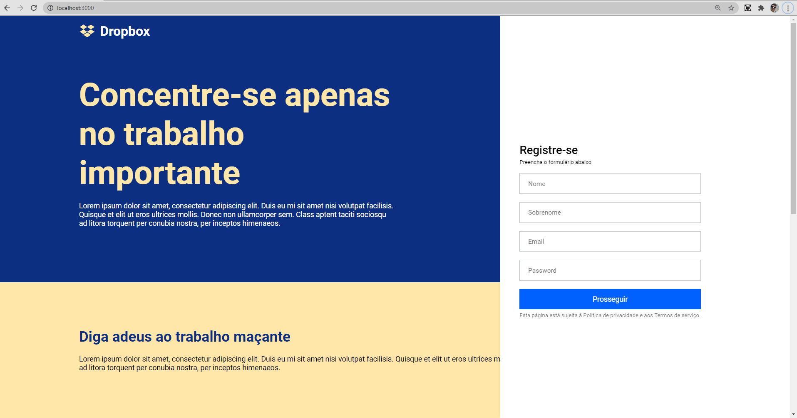
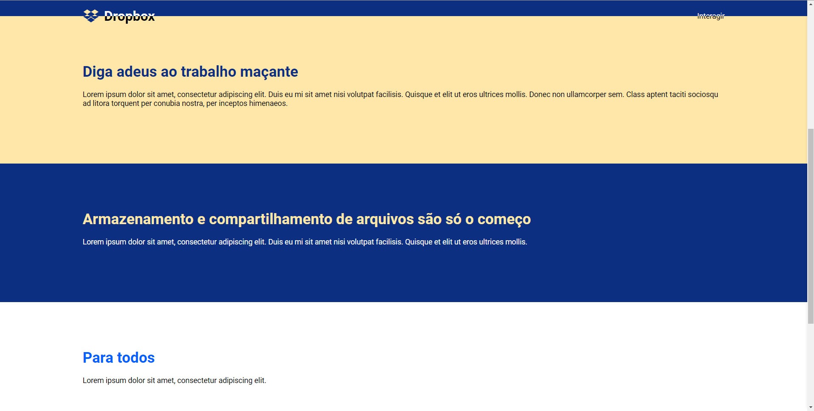

<h1 align="center">
    
</h1>

<h4 align="center">
    A Dropbox web page clone
</h4>

---

<p align="center">
  

  

  

  
</p>

<h2>📔 Description</h2>

## A Dropbox web page clone, with a magic header

`Web Application`

<details>
  <summary>See</summary>




</details>

<h2>🚀 Technologies</h2>

- [Typescript](https://www.typescriptlang.org/)
- [ReactJS](https://reactjs.org/)
- [Styled Components](https://styled-components.com/)
- [ESLint](https://eslint.org/)

---

<h2>❓ How to use</h2>

`Web`

```bash
# Clone this repository
$ git clone https://github.com/gustavosimon/dropbox-interface/tree/master/frontend

# Go into the repository
$ cd dropbox-interface/frontend

# Install dependencies for the frontend
$ yarn

# Run the frontend
$ yarn start

```

Made by [Gustavo Simon!](https://www.linkedin.com/in/gustavo-simon)

[Rocketseat](https://rocketseat.com.br/)
